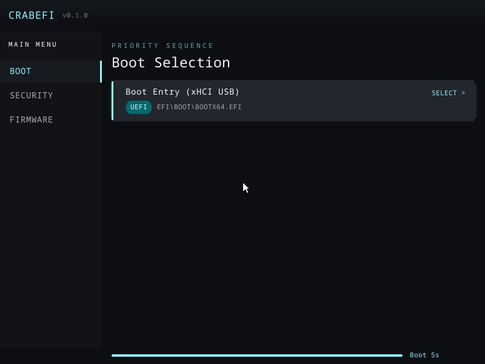

# CrabEFI

A UEFI implementation written in Rust, designed as a reusable library with dependency injection for platform-specific hardware.

CrabEFI implements enough UEFI to boot Linux via shim/GRUB2 or systemd-boot on real hardware. It ships as a coreboot payload, a platform-agnostic boot library, and a separately linked Runtime Services image with bounded scratch allocation.



*Graphical boot menu (`--features ui`), captured headlessly with
`./crabefi screenshot --app hello --out screenshot.png`. The command writes PPM
directly or converts to PNG with ImageMagick; the referenced JPG was produced
from that PNG with ImageMagick.*

## Documentation

See the [docs/](docs/README.md) directory:

- [Building](docs/BUILDING.md) - How to build CrabEFI and run tests
- [Architecture](docs/ARCHITECTURE.md) - Workspace layout and code organization
- [Integration](docs/INTEGRATION.md) - Using CrabEFI as a library in external firmware
- [Memory Management](docs/MEMORY.md) - Memory layout, allocators, and EFI memory map

## Quick Start

```bash
# Enter nix development environment (provides QEMU, mtools, etc.)
nix develop

# Build the coreboot payload
./crabefi build

# Run integration tests
./crabefi test --app hello

# Run interactively in QEMU
./crabefi run --app hello

# Build for aarch64
./crabefi build --arch aarch64
```

## Workspace Structure

| Crate | Description |
|-------|-------------|
| `crabefi-core` | Core library -- UEFI implementation and boot-time hardware drivers |
| `crabefi-coreboot` | Coreboot payload binary (arch entry points, table parsing) |
| `crabefi-runtime-abi` | Pointer-free normalized image/handoff ABI |
| `crabefi-runtime-image` | Separate EFI Runtime Services image with image-local bounded scratch allocation |

External firmware implements boot-only platform traits, provides a normalized runtime image plus value-only runtime mechanisms in `PlatformConfig`, and calls `crabefi::init_platform()`. See [docs/INTEGRATION.md](docs/INTEGRATION.md) for details.

## License

Licensed under either of [Apache License, Version 2.0](LICENSE-APACHE) or [MIT License](LICENSE-MIT) at your option.
